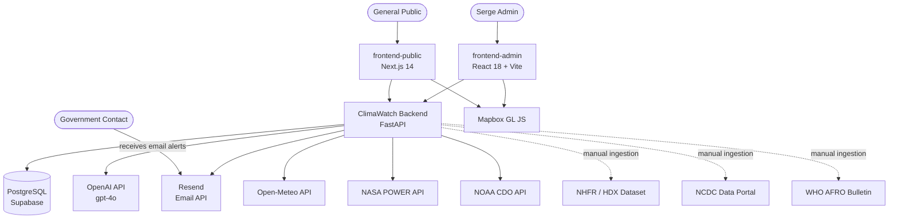
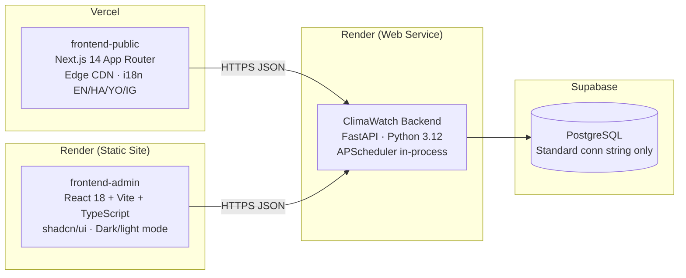
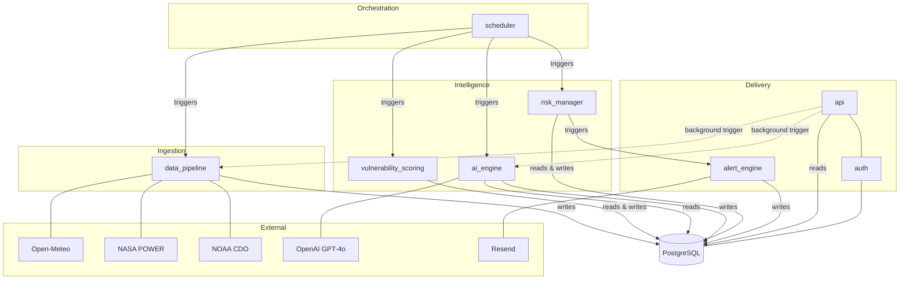
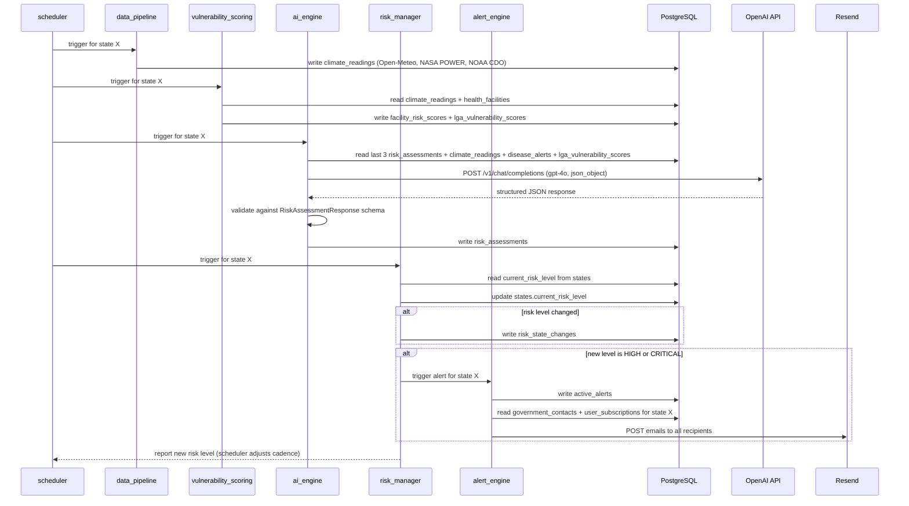
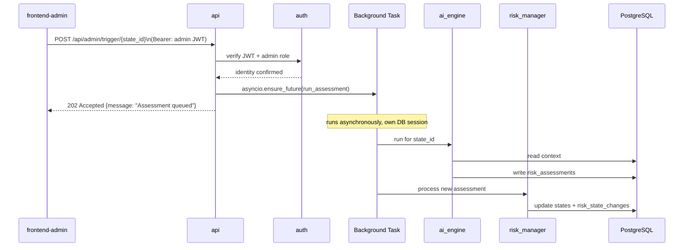
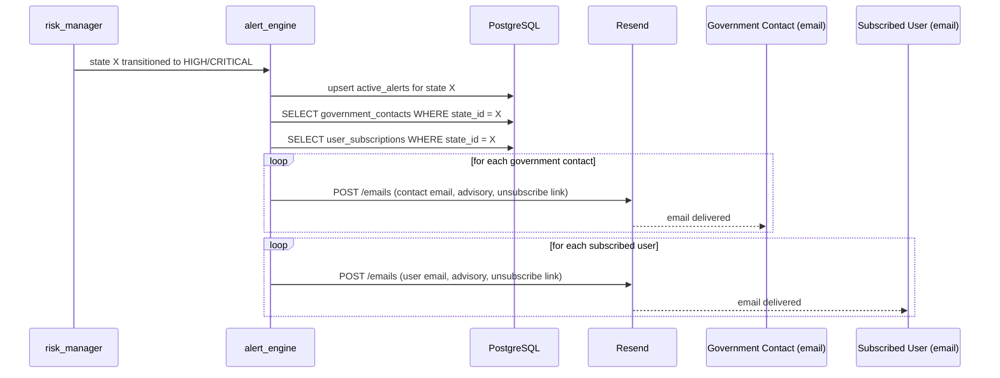
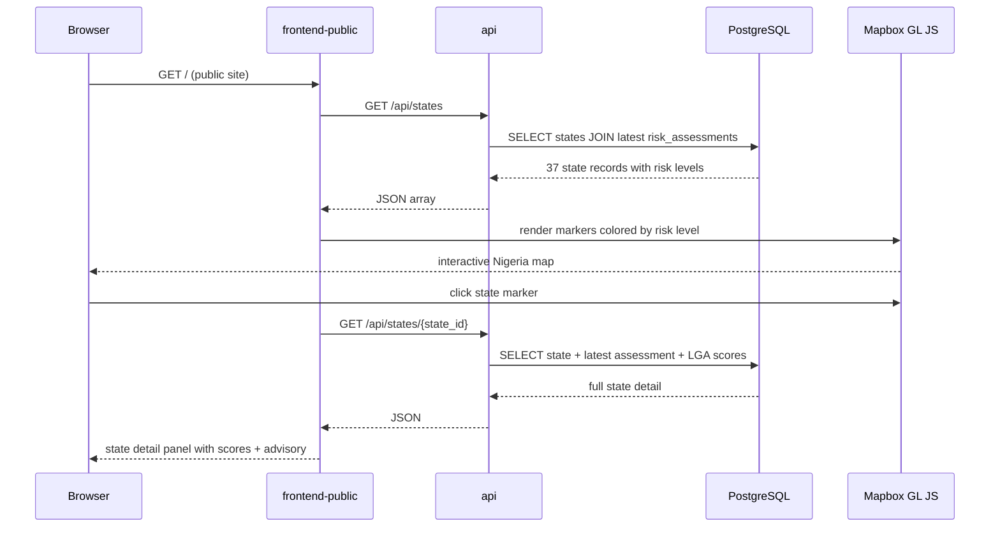

# ClimaWatch — Software Architecture

**Version:** 1.0
**Date:** July 2026
**Relates to:** [Technical Specification](technical-specification.md) · [AI Scoring Methodology](ai-scoring-methodology.md)

---

## Table of Contents

1. [Architecture Style](#1-architecture-style)
2. [System Context](#2-system-context)
3. [Container Overview](#3-container-overview)
4. [Module Map](#4-module-map)
5. [Module Specifications](#5-module-specifications)
   - [data_pipeline](#51-data_pipeline)
   - [scheduler](#52-scheduler)
   - [ai_engine](#53-ai_engine)
   - [vulnerability_scoring](#54-vulnerability_scoring)
   - [risk_manager](#55-risk_manager)
   - [alert_engine](#56-alert_engine)
   - [api](#57-api)
   - [auth](#58-auth)
   - [frontend-public](#59-frontend-public)
   - [frontend-admin](#510-frontend-admin)
6. [Key Data Flows](#6-key-data-flows)
   - [Scheduled Assessment Cycle](#61-scheduled-assessment-cycle)
   - [Manual Assessment Trigger (Admin)](#62-manual-assessment-trigger-admin)
   - [Alert Dispatch](#63-alert-dispatch)
   - [Public Data Request](#64-public-data-request)
7. [Module Dependency Matrix](#7-module-dependency-matrix)
8. [External Service Dependencies](#8-external-service-dependencies)

---

## 1. Architecture Style

ClimaWatch is a **modular monolith** — a single codebase split into well-defined internal modules, deployed as one unit per service. This is a deliberate, maintained constraint.

**Why modular monolith over microservices:**

| Concern | Modular monolith approach |
|---|---|
| Complexity | Single deployment, single database, no distributed tracing |
| Developer experience | One repo, one local stack, no service mesh |
| Data consistency | All modules share one PostgreSQL instance — no eventual consistency |
| Scalability | Render auto-scales horizontally; sufficient for this load profile |
| Replicability | Forks deploy as one unit — no multi-service orchestration needed |

Microservices will not be introduced without an explicit architectural decision and an update to this document.

---

## 2. System Context

Who interacts with ClimaWatch and how.

---

## 3. Container Overview

ClimaWatch has three deployable containers and one managed data store.

**Communication:** All frontend-to-backend calls are HTTPS REST. No WebSockets, no GraphQL, no Supabase realtime.

---

## 4. Module Map

The backend is divided into eight internal modules grouped into four functional tiers.

**Tier legend:**

| Tier | Modules | Role |
|---|---|---|
| Orchestration | `scheduler` | Drives when everything runs |
| Ingestion | `data_pipeline` | Pulls raw data from outside |
| Intelligence | `ai_engine`, `vulnerability_scoring`, `risk_manager` | Transforms raw data into risk intelligence |
| Delivery | `api`, `auth`, `alert_engine` | Surfaces intelligence to users and external systems |

---

## 5. Module Specifications

### 5.1 `data_pipeline`

**Tier:** Ingestion
**File path:** `backend/app/modules/data_pipeline/`

**Purpose:** Fetches live climate data from external APIs and ingests manually uploaded health datasets. Converts raw external data into records the AI engine can consume.

**Responsibilities:**

| Responsibility | Detail |
|---|---|
| Fetch weather data | Open-Meteo API — temperature, humidity, rainfall, wind, UV for each of the 37 states |
| Fetch solar/radiation data | NASA POWER API — radiation and solar metrics per state |
| Fetch historical climate data | NOAA CDO API — historical comparison baselines per state |
| Ingest health facility dataset | NHFR via HDX — parses facility CSV/JSON into `health_facilities` table |
| Ingest disease surveillance data | NCDC Data Portal — parses dataset into `disease_alerts` table |
| Parse disease bulletin | WHO AFRO bulletin — extracts active alerts into `disease_alerts` table |
| Store readings | Writes one `climate_readings` record per state per source per run |

**Inputs:** HTTP responses from climate APIs; administrator-uploaded dataset files
**Outputs:** Records in `climate_readings`, `health_facilities`, `disease_alerts`
**External dependencies:** Open-Meteo, NASA POWER, NOAA CDO, NHFR/HDX, NCDC, WHO AFRO
**Internal dependencies:** None — foundational module with no upstream dependency

**Key constraint:** Dataset sources (NHFR, NCDC, WHO AFRO) require manual file upload and cannot be triggered programmatically from the API. Only live API sources (Open-Meteo, NASA POWER, NOAA CDO) support admin-triggered runs.

---

### 5.2 `scheduler`

**Tier:** Orchestration
**File path:** `backend/app/modules/scheduler/`

**Purpose:** Drives the automated assessment cycle for all 37 states on an adaptive schedule. It is the entry point for all automated intelligence generation.

**Responsibilities:**

| Responsibility | Detail |
|---|---|
| Default cycle | Run data pipeline + assessment for all states every 12 hours |
| Elevated cycle | Switch any state with risk ≥ MODERATE to a 2–3 hour cycle |
| Return to default | After a state registers LOW for 2 consecutive cycles, restore 12-hour cadence |
| Orchestrate sequence | Ensures data_pipeline runs before vulnerability_scoring before ai_engine before risk_manager — in that order, per state |
| In-process scheduling | Runs as an APScheduler background task inside FastAPI — does not block API responses |

**Inputs:** Current risk levels per state (read from `risk_assessments`); scheduler configuration
**Outputs:** Triggered execution of data_pipeline, vulnerability_scoring, ai_engine, and risk_manager
**External dependencies:** APScheduler library
**Internal dependencies:** `data_pipeline`, `vulnerability_scoring`, `ai_engine`, `risk_manager`

**Key constraint:** Background tasks that touch the database create their own `SessionLocal` session — they do not share request-scoped sessions.

---

### 5.3 `ai_engine`

**Tier:** Intelligence
**File path:** `backend/app/modules/ai_engine/`

**Purpose:** Generates a structured, multi-language risk assessment for a given state by building a context-rich prompt, calling GPT-4o, and validating the response before storage.

**Responsibilities:**

| Responsibility | Detail |
|---|---|
| Build state prompt | Assembles: last 3 assessments (trend context) + current climate readings + active disease alerts + facility vulnerability summary |
| Call OpenAI | Sends structured prompt with `response_format={"type": "json_object"}` and temperature 0.2 |
| Validate response | Validates JSON against `RiskAssessmentResponse` Pydantic schema — rejects and logs invalid responses without storing |
| Store assessment | Writes validated assessment to `risk_assessments` including all 4 language advisories |
| Notify risk_manager | Passes the new risk level to risk_manager after successful storage |

**Inputs:** Latest `climate_readings` per state; `disease_alerts`; `lga_vulnerability_scores`; previous 3 records from `risk_assessments`
**Outputs:** New record in `risk_assessments` with scores, risk level, and advisories in EN/HA/YO/IG
**External dependencies:** OpenAI API (`gpt-4o` — fixed, do not change)
**Internal dependencies:** Triggered by `scheduler` (automated) or `api` (manual trigger); feeds result to `risk_manager`

**Key constraint:** `response_format={"type": "json_object"}` is mandatory on every call. If OpenAI returns a non-JSON response, the assessment is rejected — never stored with a fallback.

See [AI Scoring Methodology](ai-scoring-methodology.md) for scoring weights, thresholds, and advisory generation rules.

---

### 5.4 `vulnerability_scoring`

**Tier:** Intelligence
**File path:** `backend/app/modules/vulnerability_scoring/`

**Purpose:** Calculates granular risk scores at health facility and LGA level, providing the infrastructure-vulnerability context that feeds into the AI engine's prompt.

**Responsibilities:**

| Responsibility | Detail |
|---|---|
| Score each health facility | Calculates a vulnerability score per facility based on its location's climate risk and the facility's own capacity indicators (type, ownership, bed count) |
| Aggregate to LGA level | Groups facility scores by LGA and computes weighted averages into `lga_vulnerability_scores` |
| Refresh on each cycle | Scores are recalculated every cycle before the AI engine runs, ensuring the AI always uses current scores |

**Inputs:** `climate_readings` for the state; `health_facilities` table (NHFR data)
**Outputs:** Updated records in `facility_risk_scores`; updated records in `lga_vulnerability_scores`
**External dependencies:** None
**Internal dependencies:** Triggered by `scheduler`; output consumed by `ai_engine` (reads scores when building state prompt)

---

### 5.5 `risk_manager`

**Tier:** Intelligence
**File path:** `backend/app/modules/risk_manager/`

**Purpose:** Detects state risk level transitions, maintains the audit trail, updates the canonical risk level on each state, and triggers the alert pipeline when thresholds are crossed.

**Responsibilities:**

| Responsibility | Detail |
|---|---|
| Detect transitions | Compares the new assessment's risk level to the state's current `current_risk_level` |
| Record change | Writes a `risk_state_changes` record with timestamp, `from_level`, `to_level`, and the AI-generated reason string on any change |
| Update state | Updates `states.current_risk_level` and `states.last_assessed_at` |
| Trigger alerts | If the new level is HIGH or CRITICAL and differs from the previous level, calls `alert_engine` |
| Signal scheduler | Reports the new risk level back to `scheduler` so it can adjust the state's cadence |

**Inputs:** New risk level from `ai_engine`; current `states.current_risk_level`
**Outputs:** Updated `states` record; new record in `risk_state_changes` (on change); trigger to `alert_engine` (on HIGH/CRITICAL transition)
**External dependencies:** None
**Internal dependencies:** Triggered by `ai_engine`; triggers `alert_engine`; signals `scheduler`

---

### 5.6 `alert_engine`

**Tier:** Delivery
**File path:** `backend/app/modules/alert_engine/`

**Purpose:** Creates public-facing active alerts and dispatches email notifications to government contacts and subscribed users when a state crosses a risk threshold.

**Responsibilities:**

| Responsibility | Detail |
|---|---|
| Create active alert | Writes a new record to `active_alerts` when a state enters HIGH or CRITICAL |
| Resolve active alert | Closes the active alert record when a state drops back to MODERATE or below |
| Fetch recipients | Queries `government_contacts` and `user_subscriptions` for the affected state |
| Compose email | Builds email content including: state name, risk level, AI advisory (English), recommended actions, and a one-click unsubscribe link |
| Dispatch via Resend | Sends email to each recipient via the Resend API from hello@weareserge.com |

**Inputs:** Risk transition event from `risk_manager` (state ID, new risk level, reason); `government_contacts` records; `user_subscriptions` records
**Outputs:** New/updated records in `active_alerts`; sent emails via Resend
**External dependencies:** Resend email API
**Internal dependencies:** Triggered by `risk_manager`

**Key constraint:** Every dispatched email must include a one-click unsubscribe link — this is an NDPR compliance requirement.

---

### 5.7 `api`

**Tier:** Delivery
**File path:** `backend/app/modules/api/`

**Purpose:** Exposes all platform data and operations to frontend surfaces via HTTP. The only communication channel between frontends and the backend.

**Responsibilities:**

| Responsibility | Detail |
|---|---|
| Public endpoints | Serve states, assessments, alerts, facilities, disease alerts, forecasts — no auth required |
| User auth endpoints | Register, login, subscription management, account deletion |
| Admin endpoints | Contacts CRUD, assessment logs, pipeline status, manual assessment and pipeline triggers |
| Auth enforcement | Validates JWT on all protected routes via `auth` module dependency injection |
| Role enforcement | Checks admin role on JWT payload for all admin routes |
| Pagination | Cursor-based pagination on public list endpoints; page/limit pagination on admin list endpoints |
| Background dispatch | Wraps manual assessment and pipeline triggers in `asyncio.ensure_future` — responds immediately with 202, runs task asynchronously |

**Inputs:** HTTP requests from `frontend-public` and `frontend-admin`
**Outputs:** JSON HTTP responses; dispatched background tasks (manual triggers)
**External dependencies:** None
**Internal dependencies:** `auth` (for all protected routes); reads directly from all DB tables; triggers `ai_engine` (manual assessment); triggers `data_pipeline` (manual pipeline run)

---

### 5.8 `auth`

**Tier:** Delivery
**File path:** `backend/app/modules/auth/`

**Purpose:** Handles all identity concerns — password hashing, JWT issuance, and token verification. Consumed by the `api` module as a FastAPI dependency.

**Responsibilities:**

| Responsibility | Detail |
|---|---|
| Hash passwords | bcrypt on all new passwords at registration |
| Verify passwords | bcrypt comparison on login |
| Issue JWT | Signs a JWT containing user ID, email, and role on successful login |
| Verify JWT | FastAPI `Depends` decorator that decodes and validates a JWT on any protected route |
| Enforce admin role | A second `Depends` decorator that additionally checks `role == "admin"` |

**Inputs:** Registration/login request bodies; Bearer token on protected routes
**Outputs:** JWT on login; current user identity object (injected into protected route handlers)
**External dependencies:** `python-jose` (JWT); `bcrypt`
**Internal dependencies:** None — pure utility module used by `api`

**Key constraint:** Admin accounts are seeded directly in the database. The `auth` module has no create-admin path — this is intentional.

---

### 5.9 `frontend-public`

**Container:** `frontend-public/`
**Technology:** Next.js 14 (App Router), Mapbox GL JS, next-intl

**Purpose:** The public-facing website — the primary surface for citizens, journalists, and researchers.

**Responsibilities:**

| Responsibility | Detail |
|---|---|
| State risk map | Interactive Mapbox GL JS map with 37 markers colored by risk level; hover shows popup, click opens state detail |
| State detail view | Full assessment for any state: scores, AI advisory in selected language, last updated time |
| Active alerts banner | Surfaces active HIGH/CRITICAL alerts from `/api/alerts/active` |
| Alert subscription | Authenticated users subscribe to email alerts for specific states |
| i18n | All UI strings served from `messages/` JSON files via next-intl; user selects EN, HA, YO, or IG |
| Disease alerts | Displays active NCDC/WHO AFRO alerts |
| LGA breakdown | State-level drill-down to LGA risk scores |

**External dependencies:** Mapbox GL JS (token via `VITE_MAPBOX_TOKEN`)
**Backend communication:** Calls public API endpoints; authenticated endpoints for subscription management
**i18n constraint:** No string is ever hardcoded in JSX. Every visible text goes through next-intl.

---

### 5.10 `frontend-admin`

**Container:** `frontend-admin/`
**Technology:** React 18, Vite, TypeScript, shadcn/ui, Mapbox GL JS, Tailwind CSS

**Purpose:** Internal Serge staff tool for monitoring, management, and operations.

**Responsibilities:**

| Responsibility | Detail |
|---|---|
| Dashboard | KPI cards (critical states, high risk states, active alerts, last assessment); Mapbox risk map; paginated state table |
| Contacts management | Full CRUD for government contacts with search, sort, and pagination |
| Assessments viewer | Browse all assessments with state filter, date sort, and pagination |
| Risk log | Audit trail of all state risk transitions with search and sort |
| Pipeline monitor | View last run time and record count for each data source; trigger manual runs for live API sources |
| Manual assessment trigger | Trigger an AI assessment for a specific state from the Dashboard state detail modal |

**Component library:** shadcn/ui — all UI primitives use shadcn components; no custom component is built if a shadcn equivalent exists
**Table pattern:** All tables share `TableToolbar` (search + action slot) and `TablePagination` (page/limit + row count + page number buttons) components
**Theme:** Dark/light mode via Tailwind `darkMode: 'class'`; sidebar collapse state persisted to `localStorage`

---

## 6. Key Data Flows

### 6.1 Scheduled Assessment Cycle

The core automated pipeline — runs on the adaptive schedule for every state.

---

### 6.2 Manual Assessment Trigger (Admin)

---

### 6.3 Alert Dispatch

---

### 6.4 Public Data Request

---

## 7. Module Dependency Matrix

Read rows as "this module depends on" the checked columns.

| Module | data_pipeline | scheduler | ai_engine | vulnerability_scoring | risk_manager | alert_engine | api | auth | OpenAI | Resend |
|---|:---:|:---:|:---:|:---:|:---:|:---:|:---:|:---:|:---:|:---:|
| `data_pipeline` | — | | | | | | | | | |
| `scheduler` | ✓ | — | ✓ | ✓ | ✓ | | | | | |
| `ai_engine` | | | — | ✓ | | | | | ✓ | |
| `vulnerability_scoring` | ✓ | | | — | | | | | | |
| `risk_manager` | | | ✓ | | — | ✓ | | | | |
| `alert_engine` | | | | | | — | | | | ✓ |
| `api` | ✓ | | ✓ | | | | — | ✓ | | |
| `auth` | | | | | | | | — | | |

**Foundational (no upstream deps):** `data_pipeline`, `auth`
**Most downstream (called by many):** `risk_manager`, `alert_engine`

---

## 8. External Service Dependencies

| Service | Used by | Purpose | Auth | Failure behaviour |
|---|---|---|---|---|
| Open-Meteo API | `data_pipeline` | Live weather data for all 37 states | None | Skip state readings for this cycle; log error |
| NASA POWER API | `data_pipeline` | Solar and radiation data | None | Skip state readings for this cycle; log error |
| NOAA CDO API | `data_pipeline` | Historical climate baselines | `NOAA_TOKEN` env var | Skip state readings for this cycle; log error |
| OpenAI API (gpt-4o) | `ai_engine` | Risk assessment generation | `OPENAI_API_KEY` env var | Reject and do not store; log error; do not update risk level |
| Resend | `alert_engine` | Alert email dispatch | `RESEND_API_KEY` env var | Log failed sends; active_alert record still created |
| Mapbox GL JS | `frontend-public`, `frontend-admin` | Interactive risk maps | `MAPBOX_TOKEN` env var | Falls back to placeholder; no data is lost |
| Supabase (PostgreSQL) | All backend modules | Primary data store | `DATABASE_URL` env var | System unavailable; no partial writes |

**Portability note:** Changing `DATABASE_URL` to point at any PostgreSQL host is the only step needed to leave Supabase. No other service has a Supabase-specific dependency.
